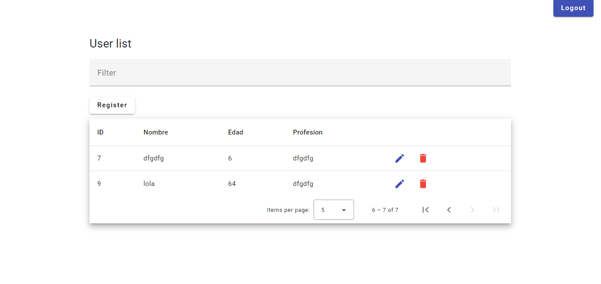

# banco_usuarios

Bienvenido a la aplicación web "Banco de Usuarios", una herramienta que te permite gestionar un banco de usuarios de manera eficiente. Esta aplicación cuenta con un backend robusto, un frontend atractivo, una base de datos MySQL y una API REST segura con autenticación por token.

## Tabla de Contenidos
- [Capturas de Pantalla](#capturas-de-pantalla)
- [Instalación](#instalación)
- [Uso](#uso)
- [Autenticación](#autenticación)
- [Licencia](#licencia)


## Capturas de Pantalla




## Instalación

### Backend

Para configurar el backend de la aplicación, sigue estos pasos:

1. Abre una terminal en la carpeta raíz del proyecto.
2. Ejecuta el siguiente comando para instalar las dependencias del servidor Express:

   ```bash
   npm install
3. Inicia el servidor Express con el siguiente comando:

    ```bash
    npm run dev
### Frontend:

Para configurar el frontend de la aplicación, sigue estos pasos:

1. Abre una terminal en la carpeta raíz del proyecto.
2. Ejecuta el siguiente comando para instalar las dependencias del frontend y agregarlo:

    ```bash
	npm install --save @angular/material @angular/cdk @angular/animations
3. Agrega el paquete de Angular Material con:

    ```bash
	ng add @angular/material
4. Inicia la aplicación frontend con el siguiente comando:
    
    ```bash
    npm start
    
    ng serve
## Uso

Antes de comenzar a utilizar la aplicación, asegúrate de que la base de datos "banco_usuarios" esté importada correctamente.

### Backend Rutas (Endpoints) 

- Obtener un registro de cliente por ID:
http://localhost:4000/api/clients/1

- Obtener todos los clientes:
http://localhost:4000/api/clients

- Obtener todos los usuarios:
http://localhost:4000/api/usuarios


### Frontend

- Accede al frontend de la aplicación visitando:
http://localhost:4200/	


## Autenticación

Puedes utilizar las siguientes credenciales para iniciar sesión en la aplicación:

- Usuario: yaris@gmail.com
- Password: yaris123


## Licencia


